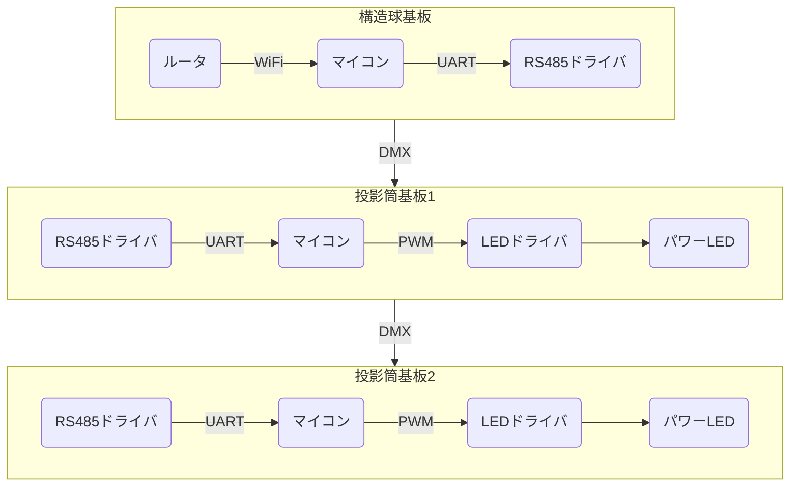
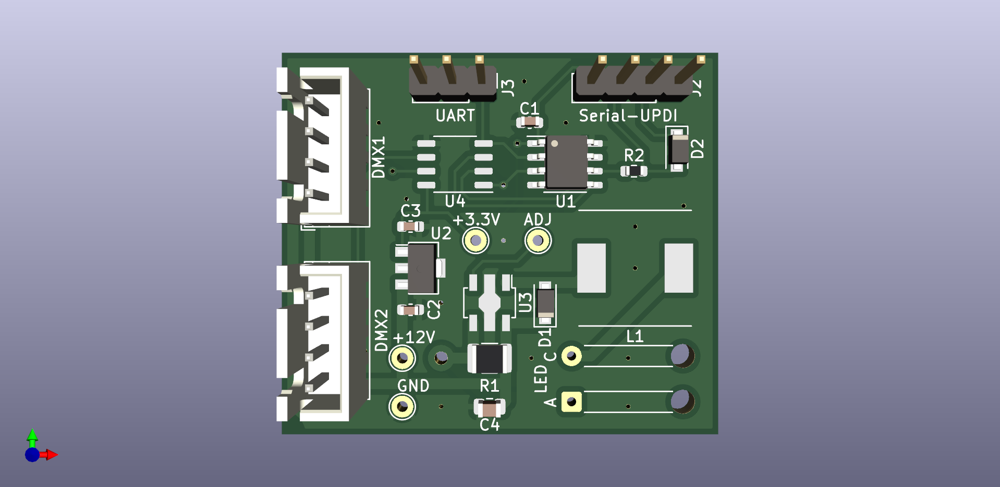

# Projector Prototype

投影筒まわりを新しくするための試作

## Concept

```mermaid
flowchart TB
  subgraph 構造球基板
    A(ルータ) --> |WiFi| B(マイコン)
    B --> |UART| C(RS485ドライバ)
  end

  subgraph 投影筒基板1
    D1(RS485ドライバ) --> |UART| E1(マイコン)
    E1 --> |PWM| F1(LEDドライバ)
    F1 --> G1(パワーLED)
  end

  subgraph 投影筒基板2
    D2(RS485ドライバ) --> |UART| E2(マイコン)
    E2 --> |PWM| F2(LEDドライバ)
    F2 --> G2(パワーLED)
  end

  構造球基板 --> |DMX| 投影筒基板1 --> |DMX| 投影筒基板2
```

## Device v0.1

- 動作確認とFirmware開発のために数個製作予定

