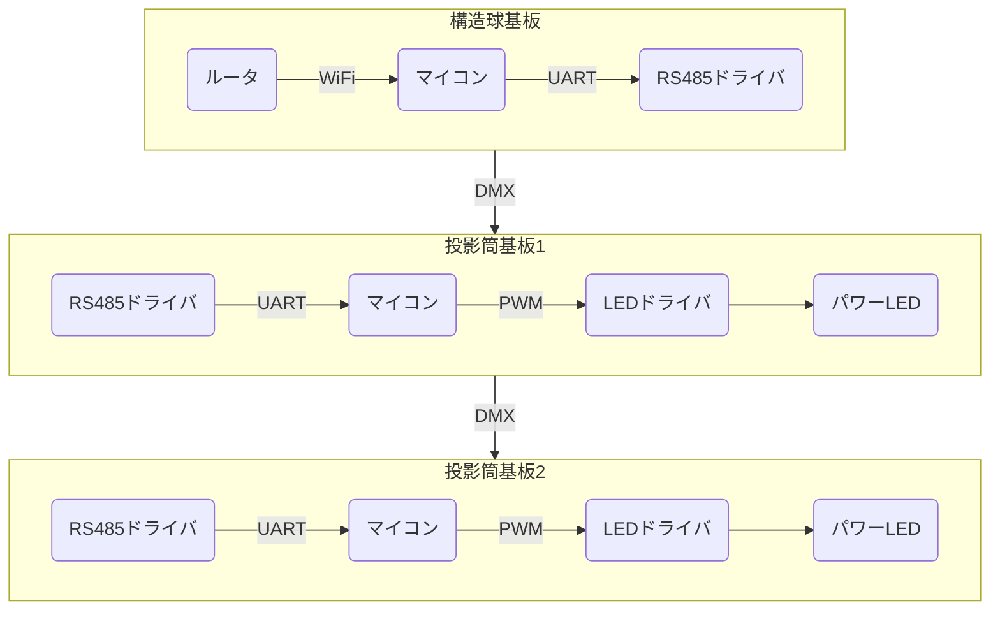

# Projector Prototype

投影筒まわりを新しくするための試作

[開発記録](https://github.com/TokyoTech-Astro/planetarium-reboot/discussions/7)

### Concept

### Idea

- スイッチング方式のLEDドライバを用いる。
  
  - 効率が良い。電流を減らせる。
  - セメント抵抗より小さくできる。
  - 調光できる。

- 点灯回路を投影筒に内臓する。

  - 基板分割で故障や仕様変更への保守性が上がる。
  - 構造球中央に大きな基板をおかなくて済む。
  - デバッグのために投影筒単体で動作させやすい。

- DMX512を用いた調光制御。
  
  - デイジーチェインで拡張性が高い。星座絵や一等星を同一バス上に配置したい。
  - DMA512はAddressibleで制御しやすい。
  - RS485の差動信号なので長距離伝送とノイズに強い。

- 投影筒単体で無線制御可能なサブシステムとする。

  - モータや昼光と分離してシンプルなサブシステムにする。
  - 使いやすいように汎用的な通信プロトコルにする。( WiFi + REST API ? )

- 12V 駆動化

  - 高電圧 + スイッチング駆動で電流を減らせる。-> 損失減、配線に有利。

- 部品は可能な限り秋月等で入手できるようにする。
