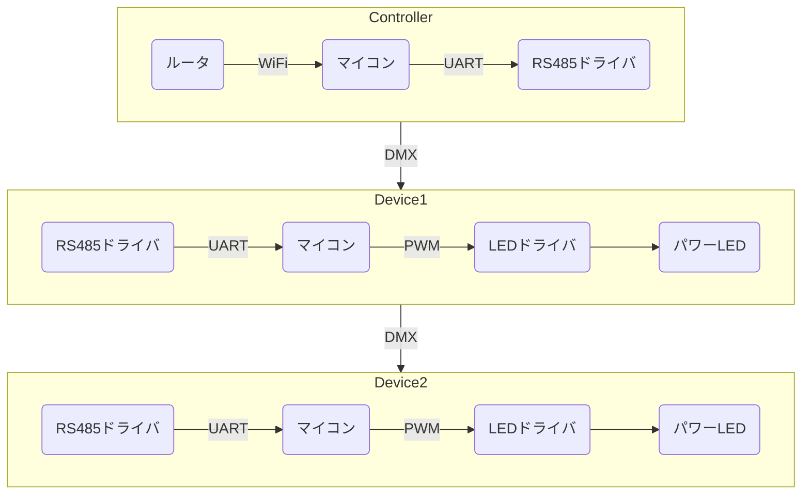

# Projector Prototype

投影筒まわりを新しくするための試作

## Circuit

LED回路と回路

### Problem

- 全体的に基板が劣化していて不安定なので、新しくしたい。

- パワーLEDの電流制限にセメント抵抗を用いており効率が悪く、発熱がひどい。

- 32個の投影筒は個別に制御できない。まとめてON、OFFできるのみ。
  演出として、地平線より下の領域が消灯できるほうがいい。過去に個別にPWM制御できた時代があるらしいが、ノイズがひどかったため、廃止されたらしい。

- 1枚の基板に32個の点灯回路を配置していて、保守性が悪い。

### Idea

- スイッチング方式のLEDドライバを用いる。
  
  - 効率が良い。電流を減らせる。
  - セメント抵抗より小さくできる。
  - 調光できる。

- 点灯回路を投影筒に内臓する。

  - 基板分割で故障や仕様変更への保守性が上がる。
  - 構造球中央に大きな基板をおかなくて済む。
  - デバッグのために投影筒単体で動作させやすい。

- DMX512を用いた調光制御。
  
  - デイジーチェインで拡張性が高い。星座絵や一等星を同一バス上に配置したい。
  - DMA512はAddressibleで制御しやすい。
  - RS485の差動信号なので長距離伝送とノイズに強い。

- 投影筒単体で無線制御可能なサブシステムとする。

  - モータや昼光と分離してシンプルなサブシステムにする。
  - 使いやすいように汎用的な通信プロトコルにする。( WiFi + REST API ? )

- 12V 駆動化

  - 高電圧 + スイッチング駆動で電流を減らせる。-> 損失減、配線に有利。

- 部品は可能な限り秋月等で入手できるようにする。

### Concept

Device -> 投影筒基板 ( 子機 )、Controller -> 構造球基板 ( 親機 )

- LEDドライバ：CL6808  
  https://akizukidenshi.com/catalog/g/gI-06278/
  
  Max 1.2A  

- 投影筒マイコン：ATTiny 202  
  https://akizukidenshi.com/catalog/g/gI-15731/

  低価格、Arduino IDE 使用可能  
  不足気味・・・

- RS485ドライバ：MAX485ED  
  https://akizukidenshi.com/catalog/g/gI-16568/
